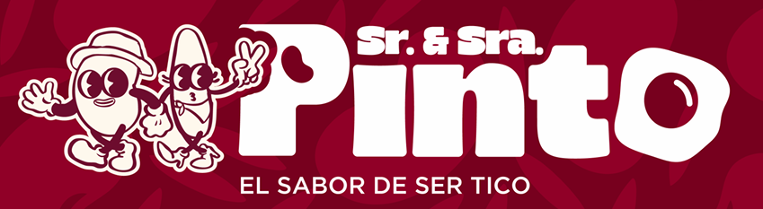

# 🇨🇷 Sr. & Sra. Pinto | Link-in-Bio Neuromarketing Hub



> **"El puritico sabor de ser tico."**
> Un Hub de enlaces hiper-optimizado utilizando diseño *Mobile-First*, GSAP Animations y técnicas avanzadas de **Neuroventas** para maximizar la conversión en pedidos de WhatsApp.

---

## 🧠 Arquitectura de Neuroventas Aplicada

Este proyecto no es una simple "Link in Bio" (árbol de enlaces). Está construido sobre bases psicológicas de la interacción humana para guiar la atención del consumidor e impulsar de forma subconsciente el deseo de compra ("Call to Action").

### 1. El Efecto Von Restorff (Aislamiento Visual)
El cerebro humano tiende a recordar y elegir el elemento que más destaca en un grupo. 
En nuestra UI central:
* Hemos roto el patrón visual monótono de las tarjetas (cards) genéricas.
* El Botón de Pedido Principal tiene un grosor de borde único (`border-[5px]`), dimensiones extendidas, y utiliza el color `--pink` activo contra el de fondo.

### 2. Visión Periférica y Movimiento (Pulse-Glow)
El sistema visual periférico del ser humano es hiper-sensible al movimiento.
* Hemos integrado `@keyframes pulse-glow` usando *Glassmorphism* (sombras de color `--pink` difuminadas a 0 de opacidad).
* Generamos un latido dinámico a través de `gsap.to('.cta-pulse', {scale: 1.03})` que simula un "latido de corazón" sutil, atrapando la atención del usuario instintivamente.

### 3. Prueba Social Subconsciente (Social Proof)
* Añadimos un pequeño badge parpadeante superior: `🔥 Más de 500 pedidos servidos`. Esto reduce la fricción mental y objeciones de confianza al ver que "la tribu" ya valida al vendedor.

### 4. Ley de Hick (Reducción de Carga Cognitiva)
* El menú superior se distribuye tabulado y en secciones colapsables (Destacados, Redes, Productos, Contactos). Esto no inunda de información la pantalla del celular; solo le muestra al usuario la categoría focalizada.

---

## 🛠️ Tecnologías y Stack

* **Estructura y DOM:** HTML5 Semántico
* **Estilos:** Tailwind CSS (CDN) + Vanilla CSS (`style.css` para componentes complejos, patrones de fondo y keyframes nativos).
* **Interactividad y Animaciones:** Javascript (ES6+) + [GSAP (GreenSock)](https://gsap.com/).

---

## 📂 Estructura del Ecosistema del Código

```text
/
├── assets/
│   ├── images/         # Recursos (logos, slogans, iconos corporativos)
├── css/
│   └── style.css       # Sistema de Diseño, Variables CSS, Keyframes y Media Queries
├── js/
│   └── main.js         # Lógica modular: StateManager, UIController, AnimationEngine
├── index.html          # Interfaz principal de usuario
└── README.md           # Documentación Corporativa
```

---

## ⚙️ Características Técnicas Clave

* **Parallax Mousemove (Desktop):** Movimiento interactivo del ratón que mueve en el Eje X/Y las tarjetas.
* **Scroll-To Fluidos:** Posicionamiento por medio de animaciones GSAP basadas en Viewport para celulares.
* **Componentes de Accesibilidad:** Implementación correcta de etiquetas semánticas y manipulación interactiva de atributos `data-category`.

## ©️ Licencia y Derechos

**Sr. & Sra. Pinto © 2024-2025**
*El puro sabor de ser Tico*
Desarrollo estructurado y analizado por **Senior Hub**.
